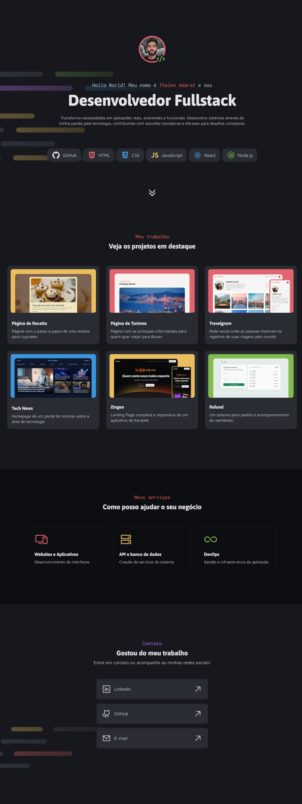

# Portfolio Dev

**Site desktop de portfólio para desenvolvedores, com links para projetos e contato do profissional.**

- Este projeto faz parte da [Formação Full Stack](https://github.com/thalesamaral/fullstack-portfolio/tree/main) da [Rocketseat](https://www.rocketseat.com.br/)
- Implementação: https://thalesamaral.github.io/fullstack-portfolio/01-Nivel/05-Desafio-Portfolio_Dev

### Desafio prático

> Chegou a hora de aplicar toda a teoria que você aprendeu até aqui colocando a mão na massa! Este é o momento de transformar conhecimento em ação, desenvolvendo um projeto que vai consolidar suas habilidades e te preparar um pouco mais para os desafios reais!

## ✨ Recursos Aprendidos

**Fundamento**

- CSS Grid
- CSS Flexbox
- CSS Position
- CSS pseudo-classes, pseudo-elements

**Conceito**

- Layouts complexos com CSS
- Posicionamento de elementos
- Variáveis organizadas

## 💻 Tecnologias Utilizadas

- HTML
- CSS

## 📝 Como Executar o Projeto

1. Clone o repositório para sua máquina local.
2. Abra o arquivo `index.html` em seu navegador web.

## ✏️ Design

- [Figma](https://www.figma.com/community/file/1387080701963671866).
- Design feito por [Rocketseat](https://www.rocketseat.com.br/).

## 👀 Preview

# 👨‍💻 Autor

### [**Thales Amaral Lima**](https://github.com/thalesamaral)

🛠 `Fullstack` Developer  
📍 Brasília - Brasil

&nbsp;&nbsp;&nbsp;&nbsp; 
