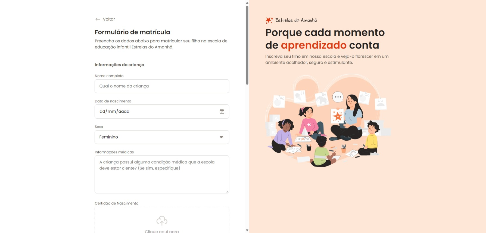

# Formulário de Matrícula

**Formulário desktop para uma escola de educação infantil.**

- Este projeto faz parte da [Formação Full Stack](https://github.com/thalesamaral/fullstack-portfolio/tree/main) da [Rocketseat](https://www.rocketseat.com.br/)
- Implementação: https://thalesamaral.github.io/fullstack-portfolio/01-Nivel/06-Projeto-Formulario_de_Matricula

## ✨ Recursos Aprendidos

**Fundamento**

- HTML Forms
- Fields: fieldset, input, select, button
- Input: text, textarea, data, number, checkbox, radio, file
- Display: position, flex, grid
- CSS Units: rem
- CSS Functions
- Estilização de -webkit

**Conceito**

- Input file: droparea
- Página com dois tipos de overflow: hidden & scroll(auto)
- svg diretamente no HTML
- `all: unset;`
- Centralizar `top: 50%; transform: translateY(-50%);`

## 💻 Tecnologias Utilizadas

- HTML
- CSS

## 📝 Como Executar o Projeto

1. Clone o repositório para sua máquina local.
2. Abra o arquivo `index.html` em seu navegador web.

## ✏️ Design

- [Figma](https://www.figma.com/community/file/1365016793556649696).
- Design feito por [Rocketseat](https://www.rocketseat.com.br/).

## 👀 Preview

# 👨‍💻 Autor

### [**Thales Amaral Lima**](https://github.com/thalesamaral)

🛠 `Fullstack` Developer  
📍 Brasília - Brasil

&nbsp;&nbsp;&nbsp;&nbsp; 
