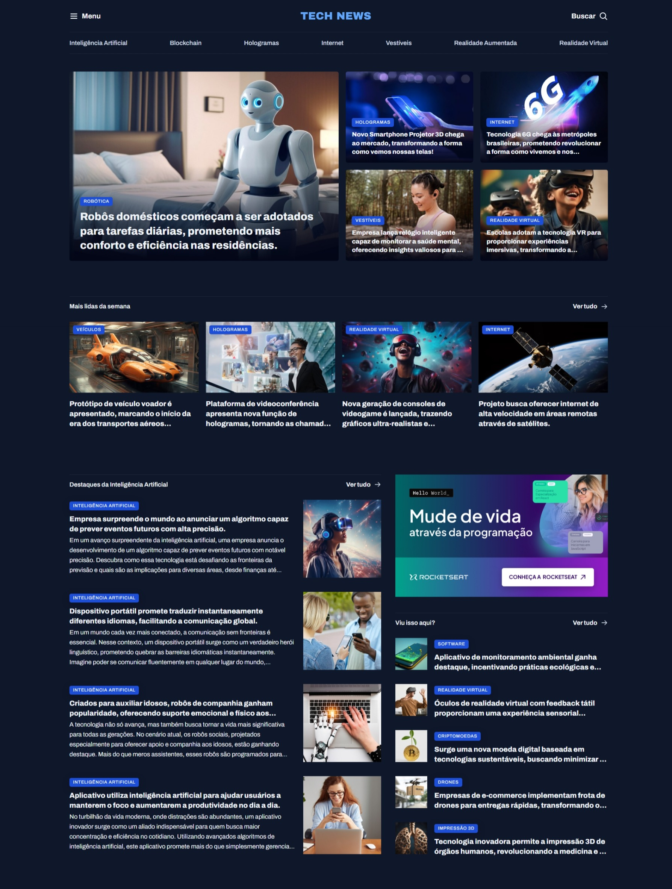
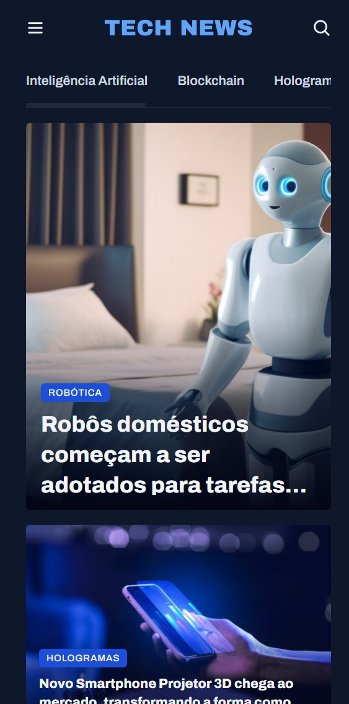

# Portal de Notícias

**Homepage responsiva de um portal de notícias sobre tecnologia.**

- Este projeto faz parte da [Formação Full Stack](https://github.com/thalesamaral/fullstack-portfolio/tree/main) da [Rocketseat](https://www.rocketseat.com.br/)
- Implementação: https://thalesamaral.github.io/fullstack-portfolio/01-Nivel/09-Desafio-Responsividade/02-Desafio-Portal_de_Noticias

## ✨ Recursos Aprendidos e em Destaque

**Fundamento**

- Responsive Web Design & Media Queries
- CSS Website Layout
- CSS Grid
  - grid-template-areas
- CSS Flex
- CSS Units: rem
- CSS Pseudo-classes, pseudo-elements

**Conceito**

- Criação da utility.css: Para melhor agrupamento dos estilos
- Modo de desenvolvimento: Mobile first
- `class="desktop-only";`
- figure & figcaption
- article
- card & content tag
- `utility.css`

## 💻 Tecnologias Utilizadas

- HTML
- CSS

## 📝 Como Executar o Projeto

1. Clone o repositório para sua máquina local.
2. Abra o arquivo `index.html` em seu navegador web.

## ✏️ Design

- [Figma](https://www.figma.com/community/file/1392188698846698895).
- Design feito por [Rocketseat](https://www.rocketseat.com.br/).

## 👀 Preview

### Desktop

### Mobile

# 👨‍💻 Autor

### [**Thales Amaral Lima**](https://github.com/thalesamaral)

🛠 `Fullstack` Developer  
📍 Brasília - Brasil

&nbsp;&nbsp;&nbsp;&nbsp; 
