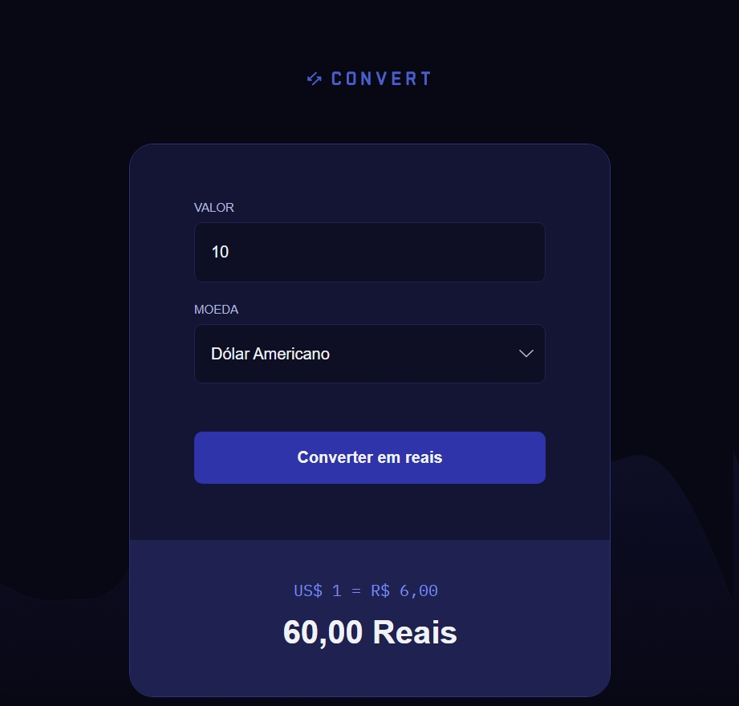

# Convert - Conversor de Moedas

**Convert é uma aplicação web de conversão de moedas para real. Atualmente com valores monetários fixos.**

- Este projeto faz parte da [Formação Full Stack](https://github.com/thalesamaral/fullstack-portfolio/tree/main) da [Rocketseat](https://www.rocketseat.com.br/)
- Implementação: https://thalesamaral.github.io/fullstack-portfolio/02-Nivel/01-Projeto-Convert

#### Desafio

- ✅ Realizei algumas mudanças ao projeto da aula, tentando aproximar ao design do Figma (**logo abaixo**).
- ❌ Ficou pendente a estilização do campo de seleção, que seria interessante realizá-la com ajuda do Javascript.
- ❌ Nível mais avançado: Tornar os valores monetários dinâmicos e sempre atualizados.

## ✨ Recursos Aprendidos e em Destaque

**Fundamentos e conceitos de Javascript**

- Document Object Model (DOM)
- Query Selector
- Arrow Function
- preventDefault()
- isNaN()

**Conceitos**

- Manipulando conteúdo e atributos
- Acessando e criando elementos
- Adição e remoção de classe
- Eventos específicos, em formuulário e input

## 💻 Tecnologias usadas

- HTML
- CSS
- JAVASCRIPT

## 📝 Como executar o projeto

1. Clone o repositório para sua máquina local.
2. Abra o arquivo `index.html` em seu navegador da web.

## ✏️ Design

- [Figma](https://www.figma.com/community/file/1360315742205904074/conversor-de-moedas).
- Design feito por [Rocketseat](https://www.rocketseat.com.br/).

## 👀 Preview

# 👨‍💻 Autor

### [**Thales Amaral Lima**](https://github.com/thalesamaral)

🛠 `Fullstack` Developer  
📍 Brasília - Brasil

&nbsp;&nbsp;&nbsp;&nbsp; 
